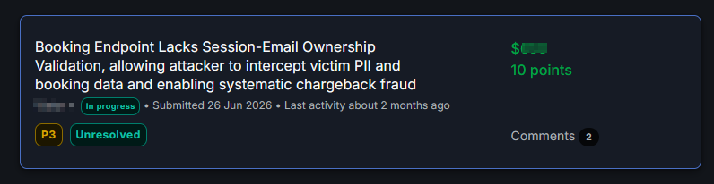

# Email Pre-Hijacking Causes Booking and Account Confusion

**Vulnerability:** Account Pre-Hijacking / Identity Confusion / Business Logic  
**Severity:** High  
**Status:** Validated and Paid  
**Environment:** Production  
**Affected flows:** Email Change + Booking / Account Creation


```text
*Sanitized evidence of the report's triaged state. Private report identifiers, target details, and sensitive information have been redacted.*
```
[ VIDEO POC ]     
[ LAB ]     

---

## 1. Overview

The application allowed an authenticated user to change the email address on an existing account without verifying ownership of the new email address.

This allowed an attacker to pre-register an unused victim email address on the attacker's existing account.

When the victim subsequently submitted a booking using that email address, the application's account-creation logic associated the victim's booking information with the attacker's existing account session.

As a result, the attacker could access the victim's booking information and personal data, while the victim subsequently found an account with no visible booking.

The finding was triaged and paid by the program.

---

## 2. Security Boundary

Email addresses functioned as an important identity boundary in the application.

The expected model was:

```text
Email address
      ↓
Account identity
      ↓
Booking identity
      ↓
User's booking and personal information
```

The application already prevented normal registration using an email address that belonged to an existing account.

However, the email-change flow did not enforce the same ownership requirement.

The attacker could therefore establish this state:

```text
Attacker Account
      ↓
Victim's unused email address
      ↓
No verification required
```

The application subsequently treated the victim's email as belonging to the attacker's account.

---

## 3. Affected Functionality

### Account Settings

Email-change functionality allowed an authenticated account to replace its email address without confirmation of ownership of the new address.

### Booking / Account Creation

An unauthenticated user could submit a booking using an email address that had already been attached to the attacker's account through the unverified email-change flow.

The interaction between these two flows created the vulnerability.

---

## 4. Attack Flow

The complete attack chain was:

```text
Attacker creates or uses existing account
              ↓
Attacker changes account email
              ↓
Victim's unused email is supplied
              ↓
No verification of new email
              ↓
Victim later submits booking
              ↓
Application creates/updates account context
              ↓
Victim booking data enters attacker's account
              ↓
Attacker can view victim information
              ↓
Victim accesses account and finds no booking
```

This was not a simple email-change vulnerability.

The security impact resulted from the interaction between the email-change mechanism and the booking/account-creation workflow.

---

## 5. Discovery

The email-change functionality was tested using a researcher-controlled attacker account.

The account email was changed to another researcher-controlled email address that did not yet have an account.

The application accepted the change immediately.

No verification message was required at the new address before the new email became active.

This suggested that the email address could be claimed by an account without proving ownership.

The next test was to determine what would happen when the platform's booking flow subsequently encountered that same email address.

---

## 6. Proof of Concept

### Phase 1 — Pre-Hijack the Email Address

The attacker authenticated to an existing account.

The attacker then changed the account email to:

```text
victim-test@example.invalid
```

The application accepted the change without requiring verification at the new address.

Expected behavior:

```text
Email change
      ↓
Verification sent to new address
      ↓
New email confirmed
      ↓
Email change becomes active
```

Observed behavior:

```text
Email change
      ↓
No verification
      ↓
New email immediately active
```

---

## 7. Phase 2 — Victim Submits Booking

A separate unauthenticated browser session was used to simulate the victim.

The booking was submitted using the same email address that had previously been attached to the attacker's account.

The booking completed successfully.

The victim's test booking contained personal information and payment data.

---

## 8. Phase 3 — Attacker Receives Victim Data

The attacker returned to the existing account session and refreshed the application.

The attacker's account now displayed information associated with the victim's booking.

The exposed information included:

- Phone number
- Home-town/address information
- Booking information
- Other booking-associated personal information visible through the affected interface

The important observation was that the attacker did not authenticate as the victim.

The attacker remained authenticated as the attacker's own account.

---

## 9. Phase 4 — Attacker Disassociates

The attacker changed the account email back to the original attacker-controlled address.

After refreshing the account, the victim's booking information remained accessible within the attacker's account context.

This demonstrated that the attacker could restore their original email identity without necessarily losing access to the booking data that had already been associated with the account.

---

## 10. Phase 5 — Victim Finds No Booking

The victim subsequently completed the application's email-login flow using the email address associated with the booking.

The resulting account did not contain the expected booking.

The observed state was effectively:

```text
Victim

Email → Account
         ↓
      No booking
```

while the attacker retained:

```text
Attacker

Account
   ↓
Victim booking
   ↓
Victim PII
```

This demonstrated an account-association failure rather than merely an email-address takeover.

---

## 11. Authorization / Identity Model

The important identities in the attack were:

| Actor | Authentication state | Email state | Result |
|---|---|---|---|
| Attacker | Authenticated | Controls attacker account | Can change email |
| Attacker | Authenticated | Uses victim's unused email | Email becomes active without verification |
| Victim | Unauthenticated | Uses same email during booking | Booking submitted |
| Attacker | Authenticated | Returns to account | Victim booking becomes visible |
| Victim | Authenticated through email flow | Uses victim email | Expected booking unavailable |

The critical boundary failure was:

```text
Email ownership
       ≠
Email supplied to account
```

The application treated these as equivalent.

---

## 12. Root Cause

The primary root cause was the absence of ownership verification when changing an account's email address.

The new email address became active immediately without requiring proof that the requester controlled that address.

This created an identity collision between:

```text
Existing account identity
        +
Unverified email identity
        +
Future booking identity
```

The booking flow subsequently relied on the email identity when creating or associating the user's account and booking data.

The combination allowed data belonging to a future booking user to become associated with an account already controlled by another user.

---

## 13. Confirmed Impact

### 13.1 Personal Information Exposure

The attacker could access personal information submitted by the victim during booking.

The demonstrated information included:

- Phone number
- Home-town/address information
- Booking details

No authentication as the victim was required.

---

### 13.2 Booking Account Confusion

The victim's booking became associated with the attacker's account context.

The victim subsequently accessed an account that did not show the expected booking.

This creates a serious integrity problem because the person who submitted the booking and the account that ultimately exposes the booking are different identities.

---

### 13.3 Loss of User Access to Booking

The victim could complete the booking but subsequently fail to find the booking through the expected account.

This creates a denial-of-service condition against the legitimate user's ability to manage or evidence their reservation.

---

## 14. Business Impact

The report also identified a potential financial-fraud scenario arising from the account-association failure.

A malicious actor could potentially use the same mechanism to cause a legitimate transaction to become associated with a different account.

Conceptually:

```text
Legitimate payment
       ↓
Booking created
       ↓
Booking associated with attacker-controlled account
       ↓
Original paying account appears to have no booking
       ↓
Potential payment dispute / chargeback
```

This creates a potentially serious revenue-integrity problem because the application's own account state could become inconsistent with the original payment identity.

The demonstrated vulnerability therefore extends beyond privacy into potential financial abuse.

---

## 15. Scale Risk

The attack does not require privileged access.

The basic prerequisites are:

```text
Existing account
        +
Second unused email address
```

The attack can therefore potentially be repeated against multiple email addresses.

The absence of verification at the email-change stage makes the attack particularly dangerous because the attacker does not need to compromise the victim's mailbox.

---

## 16. Triage Evidence

The original report was validated and paid by the security program.

Private report identifiers, production URLs, and confidential triage communications are intentionally omitted from this public case study.

---

## 17. Remediation

### 1. Verify New Email Ownership

Require confirmation through the new email address before the change becomes active.

The old email should remain associated with the account until verification succeeds.

```text
Old email
    ↓
Request email change
    ↓
Verification sent to new email
    ↓
New email confirmed
    ↓
Change becomes active
```

### 2. Isolate Booking Account Creation

A booking submission should not silently populate an already-authenticated account merely because the submitted email matches that account.

The account-creation process should establish the correct identity before attaching sensitive booking data.

### 3. Prevent Cross-Identity Data Binding

Booking data should be bound to the identity established by the booking transaction rather than simply matching an unverified email address to an existing account.

### 4. Rate Limit Email Changes

Rate limiting should reduce the ability to repeatedly pre-register large numbers of email addresses.

### 5. Audit Email Changes

Record security-relevant email changes, including:

- Timestamp
- Previous email
- New email
- Account identifier
- Source IP
- Verification state

These events should be available for abuse detection and investigation.

---

## 18. Research Takeaway

This vulnerability demonstrates why identity should not be treated as a simple string comparison.

The critical assumption was effectively:

```text
Email address = Account identity
```

But an email address that has not been verified does not establish ownership.

The deeper security question is:

> Can an attacker cause the application to associate a future user's data with an account the attacker already controls?

In this case, the answer was yes.

The vulnerability was created by combining two individually understandable workflows:

```text
Unverified email change
          +
Booking-driven account creation
          =
Cross-account data association
```

This is a useful example of why business-logic research should examine **interactions between workflows**, rather than testing each endpoint in isolation.
