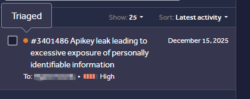

# API Key Exposure Leads to Unauthorized PII and Financial Data Access

**Vulnerability:** Unauthenticated Database Access / Sensitive Data Exposure  
**Status:** Validated - Paid    
**Affected Service:** Firebase Realtime Database


```text
*Sanitized evidence of the report's triaged state. Private report identifiers, target details, and sensitive information have been redacted.*
```
---
## Summary

During reconnaissance on GitHub, I discovered a publicly accessible
Firebase configuration associated with a REDACTED application.

The configuration exposed the Firebase project details required to
interact with the associated Realtime Database.

The database was accessible without authentication and contained
personally identifiable and financial information belonging to users.

---

## Discovery

The exposed Firebase configuration contained a Firebase Realtime
Database endpoint.

The relevant configuration included:

        ```javascript
        firebaseConfig = {
        apiKey: "REDACTED",
        authDomain: "REDACTED",
        databaseURL: "https://REDACTED.firebaseio.com",
        projectId: "REDACTED"
        }

The API key and configuration were publicly exposed in a GitHub
repository.

This report intentionally redacts the original API key, project
identifiers, user information, and database URL.

---

## Proof of Concept

The exposed Firebase configuration revealed the associated Realtime
Database endpoint.

A request to the database root returned data without requiring an
authenticated Firebase session:

curl -i https://REDACTED.firebaseio.com/.json

The response contained user information including:

Names
Email addresses
user UUIDs
Dates
Room numbers
Transaction information
Currency and payment-related data

---

## Attack Flow

```text
Public GitHub repository
        ↓
Firebase configuration discovered
        ↓
Firebase project identified
        ↓
Realtime Database endpoint identified
        ↓
Unauthenticated database request
        ↓
Guest records returned
        ↓
PII and financial information exposed
```
---

## Confirmed Impact

The database exposed personally identifiable information and financial
data belonging to users.

The demonstrated exposure included:

user names
Email addresses
user identifiers
Dates
Room numbers
Transaction amounts
Currency information
Associated user information

The issue therefore resulted in unauthorized disclosure of sensitive
user information.

---

## Root Cause

The Firebase Realtime Database permitted unauthenticated access to
sensitive user data.

The publicly accessible Firebase configuration made the project and
database endpoint discoverable, while the database authorization rules
failed to prevent unauthorized access to the stored information.

The critical security failure was the absence of appropriate access
controls protecting the database data.

---

## Remediation

Require authentication before accessing user data.

Apply Firebase Realtime Database security rules that enforce
least-privilege access.

Prevent anonymous users from reading sensitive database paths.

Review existing Firebase database rules for unintended public access.

Remove sensitive production data from publicly accessible development
or test projects.

Rotate exposed credentials where appropriate.

Monitor repositories and deployment artifacts for accidentally
exposed configuration.

---

## Validation

The finding was validated by the program and paid as a confirmed
security vulnerability.

---

## Research Takeaway

Public cloud configuration should not automatically be treated as a
vulnerability.

The important question is what the exposed configuration allows an
unauthenticated party to access.

In this case, the security boundary failed at the database layer,
resulting in unauthorized access to sensitive user information.
