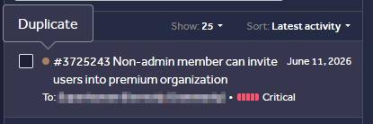

# Non-Admin Member Can Invite Users Into Premium Organization

**Vulnerability:** Broken Function Level Authorization / BOLA  
**Status:** Validated — Duplicate  
**Affected Function:** Organization member invitation  
**Endpoint:** `POST /folder/v1/organizations/{organizationId}/invites`


```text
*Sanitized evidence of the report's triaged state. Private report identifiers, target details, and sensitive information have been redacted.*
```
[ VIDEO POC ]   
[ LAB ]

---

## Summary

A non-admin member of an organization could invite users into another
organization without being its owner or administrator.

The invitation endpoint accepted an attacker-controlled `organizationId`.
Changing this value to the ID of a target organization resulted in a
successful invitation.

The invited user received a legitimate invitation, accepted it, and
became a member of the target organization.

---

## Authorization Boundary

The expected security model was:

```text
Organization Owner / Admin
        ↓
Can invite members
        ↓
Target Organization

The vulnerable behavior allowed:

Regular Member
        ↓
Change organizationId
        ↓
Target Organization
        ↓
Invite user
```

The server did not sufficiently verify that the requesting member was
authorized to invite users into the target organization.

---

## Proof of Concept

The member invitation request was sent to:

POST /folder/v1/organizations/{organizationId}/invites

The organizationId in the path was changed from the attacker's
organization to the target organization.

The server responded:

201 Created

with:

{
  "totalProcessed": 1,
  "successCount": 1
}

This confirmed that the server accepted the unauthorized invitation.

---

## Attack Flow
```text
Regular organization member
        ↓
Intercept invitation request
        ↓
Replace organizationId
        ↓
Target premium organization
        ↓
Server returns 201 Created
        ↓
Invitation email delivered
        ↓
Invitee accepts invitation
        ↓
Invitee becomes a member
```
---

## Confirmed Impact

The attacker's non-admin account was able to create an invitation
targeting an organization it did not administer.

The invited user subsequently:

Received the legitimate organization invitation.
Accepted the invitation.
Became a member of the target organization.
Obtained access to the organization's available resources.

This allowed an unauthorized member to provision users into another
organization.

---

## Root Cause

The invitation endpoint did not adequately enforce authorization against
the target organizationId.

The server accepted the organization identifier supplied in the request
without verifying that the authenticated user had sufficient privileges
within that organization to perform member invitations.

---

## Remediation

Authorization should be enforced server-side for every invitation
request.

Before creating an invitation, the backend should verify that:

The authenticated user belongs to the target organization.
The authenticated user has permission to invite members.
The target organization is actually within the user's authorized
scope.
The requested operation is permitted for the user's role.

The authorization decision should be based on the authenticated identity
and server-side organization membership, not solely on the supplied
organizationId.

---

## Validation Evidence

The finding was validated by the program and subsequently marked as a
duplicate.

---

## Research Takeaway

Authorization must be evaluated against the target resource and
operation, not just the identity of the requester.

A user may be a legitimate member of an application while still being
unauthorized to perform the same action against another organization.
