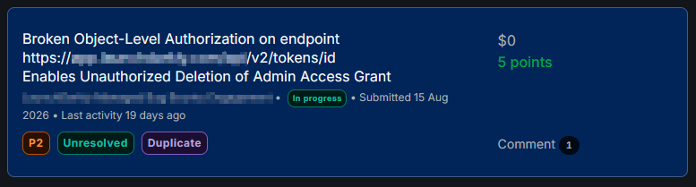

# Reader Access Level Can Delete Admin Access Token

**Vulnerability:** Broken Object Level Authorization (BOLA / IDOR)  
**Severity:** High  
**Status:** Validated finding  
**Platform:** Bug bounty program  
**OWASP:** API1:2023 — Broken Object Level Authorization


```text
*Sanitized evidence of the report's triaged state. Private report identifiers, target details, and sensitive information have been redacted.*
```
[ VIDEO POC ]   
[ LAB ]

---

## 1. Overview

A reader-level access token, representing the lowest privilege tier in the tested account, could delete an administrator-level access token by supplying the administrator token record's object identifier.

The server accepted the request and returned:

HTTP/1.1 204 No Content

The administrator token was then unusable, confirming that the operation destroyed the underlying authorization object rather than merely hiding it from the interface.

---

## 2. Security Boundary

The application contained multiple access-token records with different privilege levels:

Administrator token

Writer token

Reader token

The expected security boundary was:

Reader → limited access
Writer → intermediate access
Administrator → highest access

**Invariant:** A reader should not be able to delete an administrator-level access token.

---

## 3. Affected Endpoint

DELETE /api/v2/tokens/{_id}

The endpoint accepted a token record identifier through the path.

The vulnerability occurred because the server did not sufficiently verify whether the authenticated reader was authorized to act on the target token record.

---

## 4. Discovery

The token-listing functionality exposed the object identifiers of access-token records.

The response included identifiers for different token roles, including:

Admin token ID: [REDACTED]

Reader token ID: [REDACTED]

The reader token was then used to send a deletion request against the administrator token's identifier.

---

## 5. Proof of Concept

The following request represents the sanitized proof of concept:

DELETE /api/v2/tokens/[ADMIN_TOKEN_ID]

Host: [SANITIZED_TARGET]

Authorization: Bearer [READER_ACCESS_TOKEN]

The server responded:

HTTP/1.1 204 No Content

The administrator token was subsequently confirmed to be deleted.

A later request using the deleted administrator token failed, demonstrating that the token had been genuinely revoked or destroyed.

---

## 6. Impact

The vulnerability allowed a low-privilege user to destroy a higher-privilege access grant.

Potential consequences included:

Removal of administrator access

Disruption of account governance

Destruction of security-relevant authorization records

Denial of service against privileged workflows

Possible loss of administrative control over the affected account

The issue was especially serious because the reader role was the lowest privilege tier in the tested environment.

---

## 7. Related Object and Double-Edged Impact

The affected token records were related to account-member authorization.

This created a second impact dimension:

Low-privilege token
        ↓
Delete high-privilege token
        ↓
Disrupt administrator access
        ↓
Affect account governance

The vulnerability therefore involved both object-level authorization and privilege-boundary enforcement.

---

## 8. Attack Prerequisites

The attack required:

A valid reader-level access token.

Access to a token-listing function or another way to obtain the target token record identifier.

The ability to send a direct API request.

No special exploit tool or automation was required.

---

## 9. Technical Analysis

The server appeared to authorize the request primarily based on the authenticated session or token owner.

However, it did not adequately verify all of the following:

Whether the caller was authorized to act on the target token record.

Whether the caller's privilege level was sufficient.

Whether the target token belonged to a higher privilege tier.

Whether the path-supplied object identifier crossed an authorization boundary.

The endpoint therefore trusted the supplied {_id} without enforcing the necessary object-level authorization rules.

---

## 10. Root Cause

The likely root cause was insufficient authorization validation around the path-supplied token identifier.

The server resolved the target object using:

/api/v2/tokens/{_id}

but failed to enforce a complete authorization check between:

Authenticated caller
        ↓
Caller privilege
        ↓
Target token record
        ↓
Permitted action

Authentication was present, but authorization for the specific object and action was insufficient.

---

## 11. Remediation

The server should perform authorization checks for every operation on:

/api/v2/tokens/{_id}

The checks should verify:

The authenticated identity owns or is legitimately associated with the target record.

The caller has permission to perform the requested action.

The caller cannot delete an equal- or higher-privilege token.

The target token belongs to the expected account or member.

The requested action is permitted for the caller's current role.

For deletion specifically, the server should reject unauthorized requests with an appropriate authorization response, such as:

HTTP/1.1 403 Forbidden

The application should also avoid revealing unnecessary information about the existence, role, or ownership of protected token records.

---

## 12. Triage Evidence

The original report was submitted through a private bug bounty platform.

Public release of the original report, target identifiers, and private triage material is with-held.

---

## 13. Research Takeaway

This finding demonstrates that authentication alone does not establish authorization.

A request may contain a valid access token and still be unauthorized because the caller is acting on the wrong object or crossing a privilege boundary.

The key testing question was:

Can a lower-privilege identity perform a destructive action on a higher-privilege object by changing only the object identifier?

In this case, the answer was yes.
